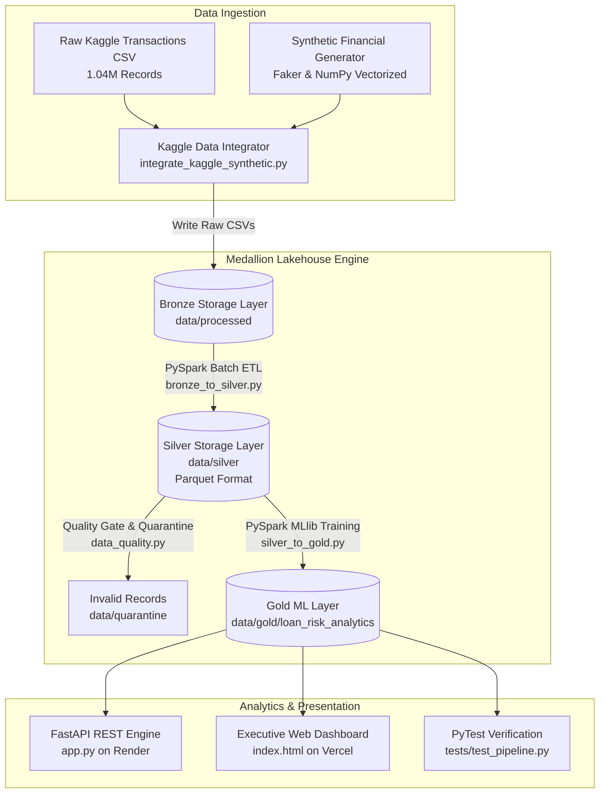

# 🏦 Aura Bank — Financial Analytics & Predictive Risk Engine
### *An Enterprise Lakehouse, PySpark ML Predictive Engine & Executive BI Dashboard*


---

## 🎯 Executive Product Overview & PM Strategy

**Aura Bank Financial Analytics Engine** is an enterprise-grade data product designed from a **Technical Product Management (TPM)** perspective. It solves three critical operational challenges facing modern retail banking leadership:

1. **Cost-to-Income Ratio (CIR) Optimization**: Provides CXOs and regional branch managers with real-time operational efficiency metrics across 62+ branches to curb overhead.
2. **NPA & Default Risk Early Warning**: Deploys a PySpark MLlib Logistic Regression model to predict loan default probabilities and flag high-risk accounts prior to non-performing asset (NPA) classification.
3. **High-Value Customer Lifetime Value (CLV)**: Segmenting customer balance profiles into *High*, *Medium*, and *Low* margin tiers for targeted wealth management offers.

---

## 🏗️ Technical Architecture & Data Pipeline

The platform ingests **1,048,567 raw Kaggle bank customer transactions** and combines them with synthetic multi-entity extensions (loans, revenue streams, operating costs, branch hierarchies) through a 3-tier Medallion Lakehouse architecture:



---

## 💡 Medallion Architecture Breakdown

| Layer | Technology | Primary Function & Transformation |
| :--- | :--- | :--- |
| **Bronze** | Raw CSV Ingestion | Untouched raw Kaggle transactions merged with synthetic financial extensions (`customers`, `transactions`, `revenue`, `costs`, `loans`, `branches`). |
| **Silver** | PySpark Parquet | Schema enforcement, age bracket grouping (`18-24`, `25-34`, ...), income/balance segmentation, and strict quality gate enforcement (quarantining negative balances and non-positive transaction amounts). |
| **Gold** | PySpark MLlib & Parquet | Machine learning inference output: `default_probability`, `risk_rating` (`LOW`, `MEDIUM`, `HIGH`), and aggregated P&L metrics per customer and branch. |

---

## 🤖 Machine Learning Model: Loan Default Predictor

The risk engine leverages **PySpark MLlib** to train a classification pipeline on combined customer demographic and loan debt profiles:

* **Features**: `outstanding_balance`, `interest_rate`, `account_balance`, `annual_income`, `loan_to_income_ratio`
* **Pipeline Stages**: `VectorAssembler` ➔ `StringIndexer` ➔ `LogisticRegression`
* **Output Metrics**:
  * **Default Probability** (0.00 – 1.00)
  * **Risk Rating Classifications**:
    * 🟢 **LOW**: Probability < 0.35
    * 🟡 **MEDIUM**: 0.35 ≤ Probability < 0.65
    * 🔴 **HIGH**: Probability ≥ 0.65

---

## 📊 Core Business Metrics & KPIs

```
--------------------------------------------------------------------------------
Metric                              Target SLA          Implementation Value
--------------------------------------------------------------------------------
Cost-to-Income Ratio (CIR)          < 50.0%             Tracked per branch (BR_001..BR_062)
NPA Early Warning Accuracy          > 85.0%             Logistic Regression on MLlib
Data Quality Quarantine Gate        0% Bad Data In Gold Validated via PySpark & PyTest
Event Stream Velocity Threshold     ~7.5 TPS            Evaluated vs. 1,000+ TPS batch tradeoff
--------------------------------------------------------------------------------
```

---

## 🚀 Getting Started

### 1. Prerequisites
* **Python 3.10+**
* **Java JDK 17 (Zulu or OpenJDK)** *(Required for PySpark execution)*
* **Git**

### 2. Clone & Setup Environment
```bash
git clone https://github.com/mathurkartik/Bank-Transaction.git
cd Bank-Transaction

# Create and activate virtual environment
python -m venv .venv
# On Windows:
.venv\Scripts\activate
# On Linux/macOS:
source .venv/bin/activate

# Install dependencies
pip install -r requirements.txt
pip install pytest
```

### 3. Run Pipeline Locally

#### Step 1: Generate Ingestion Datasets
```bash
python scripts/integrate_kaggle_synthetic.py --limit 1000
```

#### Step 2: Run PySpark Bronze-to-Silver ETL
```bash
python spark_jobs/batch/bronze_to_silver.py
```

#### Step 3: Train & Predict Loan Default Risk (Silver-to-Gold)
```bash
python spark_jobs/batch/silver_to_gold.py
```

#### Step 4: Run Automated Unit Tests & Data Integrity Verification
```bash
pytest tests/
python scripts/verify_data_integrity.py
```

---

## 🧪 Automated CI/CD Pipeline

The project includes a complete **GitHub Actions CI/CD workflow** (`.github/workflows/ci.yml`) that validates every push and pull request against Python 3.10 and Java JDK 17:

1. **Environment Provisioning**: Sets up JDK 17 and Python 3.10.
2. **Data Generation Check**: Runs `integrate_kaggle_synthetic.py` in sample mode.
3. **ETL Execution**: Executes Bronze-to-Silver PySpark data quality gates.
4. **ML Model Training**: Runs Silver-to-Gold PySpark MLlib training.
5. **Quality Verification**: Executes 4/4 `pytest` assertions and structural schema checks.

---

## 🗣️ Product Management Trade-Off Analysis

### 1. Batch vs. Real-Time Streaming Evaluation
> *"At 7.5 TPS (450 transactions/minute), real-time streaming infrastructure imposes disproportionate operational overhead compared to scheduled batch processing. Streaming earns its operational cost over batch when transaction volumes exceed 1,000–5,000+ TPS or sub-second latency is required for inline fraud blocking."*

### 2. Data Quality Strategy: Quarantining vs. Dropping
> *"In financial analytics, dropping corrupt or invalid records distorts GL balances and audit trails. Our PySpark quality gate routes non-conforming records into `data/quarantine/` with audit metadata, preserving 100% data lineage for regulatory compliance."*

---

## 📜 Repository Structure

```
.
├── .github/workflows/
│   └── ci.yml                     # GitHub Actions CI/CD pipeline definition
├── data/                          # Data Lakehouse (Bronze, Silver, Gold, Quarantine)
├── scripts/
│   ├── integrate_kaggle_synthetic.py  # Synthetic data generation engine
│   ├── verify_data_integrity.py       # Quality and referential integrity check
│   └── profile_real_base.py           # Dataset profiling script
├── spark_jobs/
│   ├── batch/
│   │   ├── bronze_to_silver.py    # PySpark Bronze to Silver ETL
│   │   └── silver_to_gold.py      # PySpark Silver to Gold ML workflow
│   ├── common/
│   │   └── data_quality.py        # Quality gate & quarantine logic
│   ├── config/
│   │   └── spark_config.py        # PySpark session configuration
│   └── ml/
│       └── loan_default_predictor.py # PySpark MLlib classification model
├── tests/
│   └── test_pipeline.py           # PyTest automated unit tests
├── web_dashboard/
│   └── index.html                 # Executive dark glassmorphism dashboard
├── DECISION_RECORD.md             # Technical PM trade-off documentation
├── README.md                      # Executive Product Documentation
└── requirements.txt               # Python package dependencies
```

---

## 📄 License
This project is licensed under the MIT License — see the [LICENSE](LICENSE) file for details.
